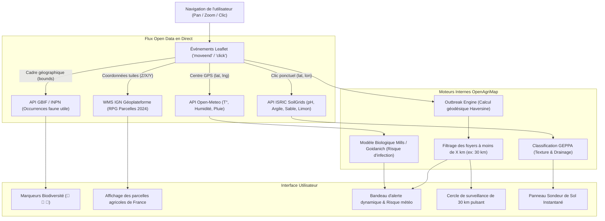

# Guide de Fonctionnement & Architecture — OpenAgriMap France 🌾🇫🇷

> **Ce document détaille le fonctionnement complet de l'application, l'origine de ses données, ses algorithmes géospatiaux et la philosophie du projet.**
> Prêt à être versionné (`git commit` et `git push`) sur votre dépôt.

---

## 1. 🎯 Vision Globale : Le « Waze » et le « Wikipédia » de l'Agriculture

L'agriculture et le jardinage manquent d'outils cartographiques ouverts, réactifs et collaboratifs :
* **Les données publiques officielles existent** (cadastre agricole PAC, inventaires de la biodiversité du Muséum, analyses de sols, météo), mais elles sont éparpillées et souvent confinées dans des fichiers lourds ou des PDF hebdomadaires.
* **Les maladies des plantes (mildiou, rouille, oïdium) se déplacent à grande vitesse** (en 48 à 72 heures sous conditions humides et chaudes).

**OpenAgriMap** résout ce défi en unifiant deux piliers :
1. **Les API Open Data institutionnelles en direct** (IGN, GBIF/INPN, ISRIC SoilGrids, Open-Meteo) pour planter le décor (sol, météo, parcelles déclarées, faune utile).
2. **Le signalement citoyen en temps réel (modèle OpenStreetMap / Waze)** pour que jardiniers, maraîchers et agriculteurs se préviennent mutuellement des épidémies locales.

---

## 2. 🔄 Schéma du Flux de Données



---

## 3. 🐝 Couche Biodiversité & Auxiliaires

### D'où proviennent les données ?
Elles sont interrogées en direct sur l'API du **GBIF (Global Biodiversity Information Facility)**, qui consolide les bases de données du **Muséum National d'Histoire Naturelle (MNHN)** via l'**INPN** (Inventaire National du Patrimoine Naturel), de la **LPO** (Ligue pour la Protection des Oiseaux) et de programmes participatifs comme **Vigie-Nature** et **Spipoll**.

### Fonctionnement technique dans `js/services.js` :
Lorsque la carte se déplace, la fonction `fetchLiveGBIFOccurrences(bounds, category)` extrait les limites géographiques de votre écran (`minLat`, `maxLat`, `minLng`, `maxLng`) et interroge l'API REST :

```text
https://api.gbif.org/v1/occurrence/search?country=FR&hasCoordinate=true&decimalLatitude=minLat,maxLat&decimalLongitude=minLng,maxLng&taxonKey={KEY}&limit=40
```

Les groupes taxonomiques sont filtrés par leur identifiant biologique officiel :
* **`taxonKey=212` (Aves / Oiseaux)** : Rapaces diurnes et nocturnes, chouettes, faucons, passereaux.
* **`taxonKey=7901` (Apoidea / Abeilles sauvages & Bourdons)** : Pollinisateurs majeurs (*Bombus*, *Osmia*, *Andrena*, *Apis mellifera*).
* **`taxonKey=216` (Insecta / Insectes auxiliaires)** : Carabes, coccinelles, chrysopes, syrphes.

### Rôle agronomique :
Les espèces affichées ne sont pas décoratives, elles représentent la **faune fonctionnelle d'auxiliaires de culture** :
* Un rapace nocturne (*Tyto alba*) élimine des milliers de campagnols ravageurs de racines.
* Une coccinelle à 7 points ou une larve de chrysope dévore jusqu'à 100 pucerons par jour.
* Les bourdons réalisent la pollinisation vibratile indispensable aux tomates et aubergines.

---

## 4. 🦠 Vigilance Sanitaire : L'Alerte Proximité (« 17 jardiniers dans un rayon de 30 km »)

### Le constat de départ :
Les Bulletins de Santé du Végétal (BSV) officiels ne paraissent qu'une fois par semaine sous forme de fichiers PDF volumineux. Face à une attaque de mildiou favorisée par un week-end d'orages chauds, ce délai est trop long.

### Le moteur participatif (`js/outbreak-engine.js`) :
Tout utilisateur peut cliquer sur **« Signaler une alerte »** pour déclarer un bioagresseur observé dans son potager ou sur sa parcelle.

1. **Calcul mathématique de distance (Formule de Haversine) :**
   Pour chaque signalement stocké dans la base, le moteur calcule la distance exacte à vol d'oiseau par rapport au centre de la vue cartographique :
   $$d = 2 R \arcsin\left(\sqrt{\sin^2\left(\frac{\Delta \text{lat}}{2}\right) + \cos(\text{lat}_1)\cos(\text{lat}_2)\sin^2\left(\frac{\Delta \text{lon}}{2}\right)}\right)$$
2. **Filtrage par le rayon de surveillance :**
   Le curseur interactif (ajustable de 5 à 80 km) filtre uniquement les signalements situés à une distance $d \le \text{rayon}$.
3. **Génération dynamique du bandeau :**
   Si 17 signalements de mildiou sont trouvés, le bandeau affiche automatiquement :
   > **« Le mildiou a été signalé par 17 jardiniers dans un rayon de 30 km. »**
   En déplaçant la carte sur la Beauce, il s'adaptera instantanément :
   > **« La rouille a été signalée par 14 agriculteurs dans un rayon de 30 km. »**

### Couplage avec la météo en temps réel (Open-Meteo) :
Le moteur interroge l'API Open-Meteo pour le point observé :
* Il récupère la **température** ($T$), l'**humidité relative** ($H$) et les **précipitations**.
* Il applique les **modèles épidémiologiques de Mills & Goidanich** :
  * Si $H \ge 82\%$ et $12^\circ\text{C} \le T \le 25^\circ\text{C}$ : les critères de sporulation du champignon sont atteints $\rightarrow$ **Risque Bioclimatique : CRITIQUE / TRÈS ÉLEVÉ**.

---

## 5. 🌾 Couche Cultures & Parcelles (RPG IGN)

* **Source :** Le **Registre Parcellaire Graphique (RPG)** de l'IGN et de l'Agence de Services et de Paiement (ASP), issu des déclarations PAC.
* **Affichage Raster WMS :**
  L'application appelle le flux national :
  ```text
  https://data.geopf.fr/wms-r/wms?LAYERS=IGNF_RPG_PARCELLES-AGRICOLES-CATEGORISEES_2024
  ```
  Ce flux affiche l'ensemble des millions d'îlots culturaux de France avec leurs couleurs officielles sans aucun téléchargement lourd.
* **Parcelles démonstratrices d'assolement :**
  Réparties sur les grands bassins agricoles (Val de Loire, Beauce, Bordelais, Bretagne, Champagne, Lauragais, etc.). Au clic, une fenêtre présente :
  * La culture courante 2026.
  * La variété officielle inscrite au catalogue **GEVES**.
  * L'**historique de rotation pluriannuel** (2024, 2025, 2026) pour évaluer la rupture des cycles de ravageurs.

---

## 6. 🌱 Le « Sondeur de Sol » Instantané

Au clic sur le bouton **« Sondeur de sol »**, l'utilisateur peut cliquer sur n'importe quel point du territoire français :

1. L'application transmet la latitude et la longitude à l'API **ISRIC SoilGrids 2.0** :
   ```text
   https://rest.isric.org/soilgrids/v2.0/properties/query?lon={lon}&lat={lat}&property=phh2o&property=clay&property=sand&property=silt&depth=0-5cm
   ```
2. L'API retourne les valeurs physiques mesurées :
   * **`phh2o`** : pH de la terre (ex: 64 $\rightarrow$ pH 6.4).
   * **`clay`** : teneur en argile (en g/kg $\rightarrow$ converti en %).
   * **`silt`** : teneur en limon (%).
   * **`sand`** : teneur en sable (%).
3. **Algorithme agronomique local :**
   * Classe la texture selon le **triangle des textures GEPPA** français (*Argile lourde*, *Limono-argileux*, *Sablo-limoneux*, etc.).
   * Estime la capacité de drainage (ressuyage rapide, équilibré ou risque d'asphyxie racinaire).
   * Formule une recommandation culturale adaptée (tolérance au calcaire, besoins en compost, correction d'acidité).

---

## 7. 🗺️ Fonds de Carte 100% Libres (Zéro Clé API)

L'application n'utilise aucun service commercial payant ou nécessitant une clé secrète :
1. **OpenStreetMap France (`osmfr`)** : rendu cartographique de l'association OSM France, toponymie des terroirs et villages français.
2. **OpenTopoMap (`opentopo`)** : courbes de niveau et relief SRTM (analyse des écoulements et des versants).
3. **IGN Géoplateforme Orthophoto (`ign`)** : imagerie aérienne haute résolution de la France sous Licence Ouverte 2.0.
4. **OpenStreetMap Standard Mondial (`osm`)** : le fond mondial classique.

---

## 8. 📁 Organisation du Code Source

```text
c:\Marc\OpenStreetMap for Agriculture\
│
├── index.html               # Structure HTML5, modale de signalement, barre de recherche IGN
├── css/
│   └── styles.css           # Design system (thème sombre émeraude, glassmorphism, animations)
│
├── js/
│   ├── app.js               # Orchestrateur central Leaflet, commutation de fonds, événements UI
│   ├── services.js          # Clients API : IGN Géocodage, ISRIC SoilGrids, GBIF, Open-Meteo
│   ├── outbreak-engine.js   # Moteur spatial de calcul de proximité (Haversine / Turf.js)
│   ├── mock-parcels.js      # Jeux de données d'amorce (> 250 foyers nationaux, 15 parcelles d'assolement)
│   └── data-sources.js      # Annuaire des métadonnées et licences Open Data
│
├── README.md                # Guide de prise en main rapide
└── FONCTIONNEMENT.md        # Présente documentation technique complète
```

---

## 📜 Licences des Jeux de Données
* **Données IGN (RPG, Géocodage, Orthophoto)** : Licence Ouverte 2.0 (Etalab).
* **Données Sol (ISRIC SoilGrids)** : Creative Commons CC-BY 4.0.
* **Données Biodiversité (GBIF / INPN)** : CC-BY 4.0 & Licence Ouverte SINP.
* **Modèle collaboratif OpenAgriMap** : Open Database License (ODbL).
